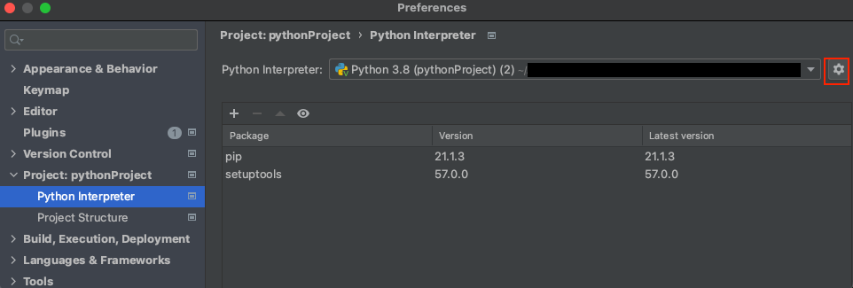
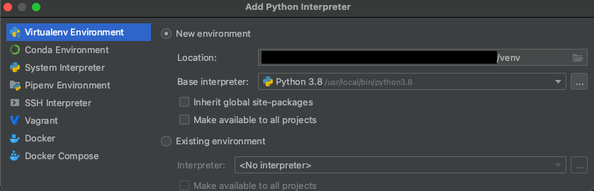
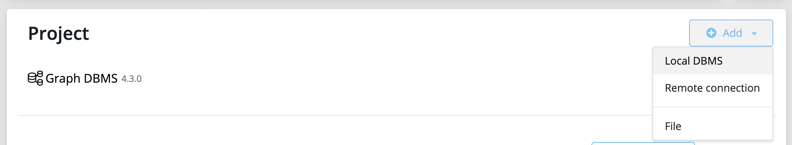
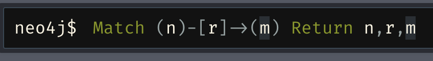

# Big-Data-Analyzer

Within this repository different approaches to find similarities between MISP-Events
have been tested.

## Setup

Before you begin, please make sure, you have the following requirements already installed
on your computer:

* Python3
* Pip3
* Neo4J (e.g. Desktop Version)

At first, you have to set up a new Python Interpreter. Depending on your IDE, this task can be a little different, as described here.

It is recommended, that you are using a virtual environment, but not necessary. Otherwise all dependencies are inatalled
directly onto your computer and can collide with other dependencies more easily. If you do not want to use a virtual
environment, you can skip to section *Installing requirements*. Else just read along.

For this example the IDE PyCharm has been used.

Go to *preferences* -> *Project: pythonProject* -> Click the Gear on the top right (as seen in the following graphic) -> Click *Add*

Select *Virtualenv Environment* -> Select *New environment* -> If necessary select a Base Interpreter

The following graphic shows the finished interpreter setup.

Afterwards, please check, if you are already inside the
virtual environment (venv). You can check this, by looking into the terminal.
There you should see the following:

`(venv) (base) <YOUR USERNAME AND OS-INFORAMTION>`

If you are missing the `(venv)` at the beginning, you have to step into your virtual environment first
with the following command:

**macOS/Linux**

`source venv/bin/activate`

**Windows**

`.\venv\Scripts\activate`

Now you should be able to see `(venv)` at the beginning of the command line.

## Installing requirements

If you open the project for the first time, or if somebody else pushed new requirements, you have to install them.

To install the missing requirements inside the virtual environment, please type the follwoing command:

`pip install -r requirements.txt`

The Requirements for this project should now be installed. You can check, by typing `pip list`.

If you want to exit the virtual environment, (for example to step into anothers virtual environment) just type `deactivate`.
The `(venv)` at the beginning should have been disappeared.
If you want to re-enter the virtual environment type the same command as before: `source venv/bin/activate` for macOS/Linux
or `.\venv\Scripts\activate` for Windows.

## Installing new packages

If you are inside your virtual environment, you can simply install new packages, without harming your
operating system or other projects.

To install new packages using pip, just type:

`pip install <PACKAGE NAME>`

Afterwards, you have to update the requirements.txt-file, so that others are also able to install
this requirement. For this please type:

`pip freeze > requirements.txt`

Best advice is to use the freeze-command everytime, before you push to the remote repository.

## Uninstalling packages

If you want to uninstall packages, please type the following two commands:

`pip uninstall <PACKAGE NAME>`

`pip freeze > requirements.txt`

## Running locally

If you intend to run the project locally, it is necessary to create a new file at the base path, where your environment variables are stored.

Name it .env (without any extension) and add the following variables (Please ask a fellow team-member to get the values):
        
        CIRCL_PDNS_USERNAME=
        CIRCL_PDNS_PASSWORD=
        NEO4J_PORT=7687
        NEO4J_DBMS_USER=neo4j
        NEO4J_DBMS_PASSWORD=password
        MISP_BASE_URL=
        MISP_API_KEY=
        LOAD_NEW_MISP_EVENTS=False (Set this to True, if you want to load new Misp Events for the anaylze proces. Takes a while.)
        USE_TEST_DATA=False (Set this to True, if you want to use test data. It is way faster, to use test data.)
        USE_ONLY_A_SAMPLE_FOR_IP_ADDRESSES=True (Set this to True, if you want to use just a sample of the ip addresses. All data takes way longer.)

Do not push any sensitive information to gitlab, instead place them inside this specific file.

Furthermore, you need to run a [neo4j](https://neo4j.com/) instance on your machine, in
which you are creating a local DBMS as seen in the following image (password is needed).
Note -> You have to add the port, the user and the password for
your local neo4j-instance to the .env file mentioned before, if they does not
fit the default values.

ou can either run the project inside a jupyter notebook or in Python. Please see the following sections, to get started with each one of them.

### Running within python (recommended)

If you want to run the code in python, you can simply start the [app.py](app.py) in the root directory, after you placed your
environment variables in the .env file.

### Running within jupyter notebooks

To run the code inside a notebook, please step into the `notebooks` folder and run
your preferred notebook, after you placed your environment variables in the .env file.
The notebooks can be found at http://localhost:8888.

### Examining the graph

When finished, you can access the neo4j graph, by opening the active DBMS inside your running neo4j instance.
In here, you can type `Match (n)-[r]->(m) Return n,r,m` for example to view the whole graph, as seen in the following graphic.

